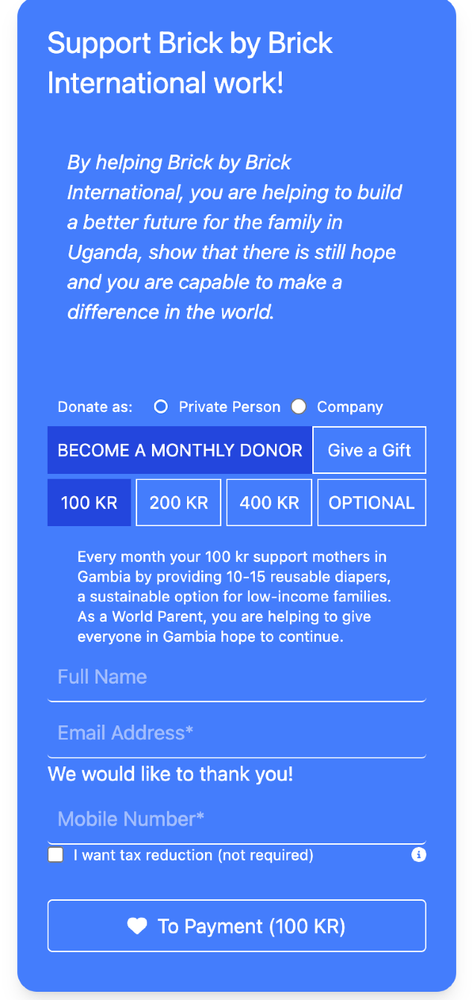
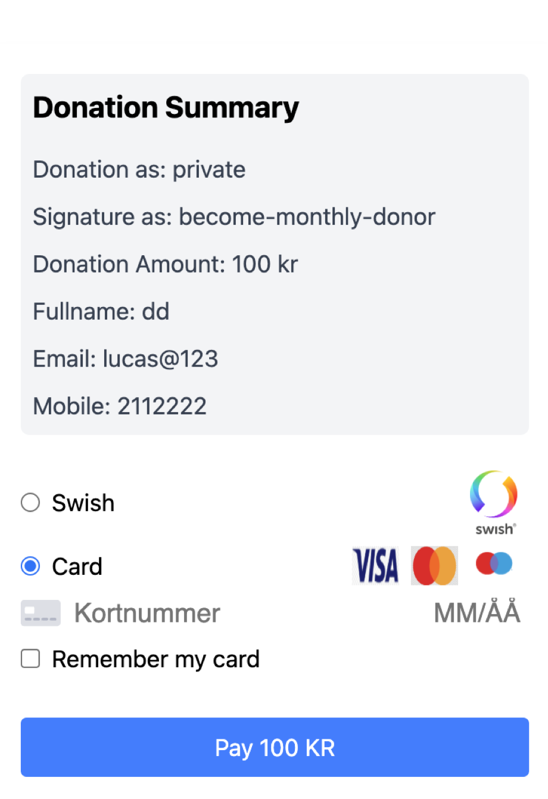

# Frontend Web application

#### Run project vite with :

    - npm run dev

## Description

    - this webpage is under construction. It is based in another project I had and it main goal is the stripe payment and paymentform.
    - I create the donation component with two forms types (Private and companyForms).

## Screenshots


``` typescript
export type TPrivateDonationFormData = {
  fullName: string;
  email: string;
  mobileNumber: string;
  checkedForTaxReduction: boolean;
  personalNumber?: string;
  donationAmount: number;
  signatureType: string;
};

export type TCompanyDonationFormData = {
  companyRegistrationNumber: string;
  companyEmail: string;
  companyFirstName: string;
  companyLastName: string;
  companyMobileNumber: string;
  donationAmount: number;
  signatureType: string;
};

export type TStripePaymentData = {
  paymentMethod: "swish" | "card";
  swishNumber?: string;
  paymentMethodId?: string;
  userId?: string;
} & (TPrivateDonationFormData | TCompanyDonationFormData);
```





# Gambia non-profitable organization

A project inspired of the a friend who wanna collect donation from family and friends to help a small community in Gambia, called Uganda.

## Frontend part

- React TS APP 
- TailwindCss
- Responsive
- SweetAlert2
- Stripe Payment


### Files Managment
```
 src/ 
        components/
            donation/
                    CompanyDonationForm.tsx
                    Donation.tsx
                    PrivateDonationForm.tsx
            Footer
            Hero1
            Hero2
            Navigation.tsx
            Projects.tsx
            User.tsx
        constants/
            contents.ts (To all webpage texts)
            donationMessages.ts
            styles.ts
        context/ 
            ThemeContext.tsx
            UserContext.tsx
        hooks/  
            CompanyDonationAmountOptions.tsx
            DonationAmountOptions (To PrivateDonationForm)
        models/
            ITheme.ts
        pages/ 
            About.tsx
            AuthPage.tsx
            Contact.tsx
            DonationPage.tsx
            GiftShopping.tsx
            Home.tsx
            Layout.tsx
            NotFound.tsx
            Partners.tsx
            PaymentPage.tsx
            ProjectPage.tsx
            ProjectsPage.tsx
            UserPage.tsx
        types/
            types.ts

```
 
# Donation.tsx

```typescript


export default function Donation() {
  const [state, dispatch] = useReducer(DonetionReducer, initialState);
  const { theme } = useTheme();

  const handleDonationTypeChange = (event: React.ChangeEvent<HTMLInputElement>) => {
    dispatch({
      type: DonationActionTypes.SET_DONATION_TYPE,
      payload: { donationType: event.target.value as "private" | "company" },
    });
  };

  const setPrivateFormData = (updatedData: Partial<TPrivateDonationFormData>) => {
    dispatch({
      type: DonationActionTypes.SET_PRIVATE_FORM_DATA,
      payload: updatedData,
    });
  };

  const setCompanyFormData = (updatedData: Partial<TCompanyDonationFormData>) => {
    dispatch({
      type: DonationActionTypes.SET_COMPANY_FORM_DATA,
      payload: updatedData,
    });
  };

  return (
    <div className={`${styles.donation.container}`}>
      
      <div className={`${styles.donation.contentContainer} ${theme.background}`}>
        <h1 className={styles.donation.title}>{DonationContent.title}</h1>
        <p className={styles.donation.description}>{DonationContent.description}</p>
        <div className={styles.donation.formContainer}>
          <div className={styles.donation.radioGroup}>
            <h1 className="text-xs p-2">Donate as:</h1>
            <input
              type="radio"
              id="private-person"
              name="donation"
              value="private"
              onChange={handleDonationTypeChange}
              checked={state.donationType === "private"}
              className="text-xs"
            />
            <label htmlFor="private-person" className={styles.donation.radioLabel}>
              Private Person
            </label>
            <input
              type="radio"
              id="company"
              name="donation"
              value="company"
              onChange={handleDonationTypeChange}
              checked={state.donationType === "company"}
              className=""
            />
            <label htmlFor="company" className={styles.donation.radioLabel}>
              Company
            </label>
          </div>
          {state.donationType === "private" && (
            <PrivateDonationForm
              formData={state.privateFormData}
              setFormData={(value) =>
                typeof value === "function"
                  ? setPrivateFormData(value(state.privateFormData))
                  : setPrivateFormData(value)
              } // Wrap to match expected type
            />
          )}
          {state.donationType === "company" && (
            <CompanyDonationForm
              formData={state.companyFormData}
              setFormData={
                (value)=>
                  typeof value === "function"
                    ? setCompanyFormData(value(state.companyFormData))
                    : setCompanyFormData(value)

              } // Wrap to match expected type
            />
          )}
        </div>
      </div>
    </div>
  );
}
```
## TODO:
  - Finish cart in giftShopping.
  - Create backend and set the fetch to the data